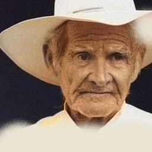

# Image-Colorization
Coloring Black &amp; White Images with the help of Autoencoder, Variational Autoencoder, Generative Adversarial Networks.

Note : This repository is updated upto Autoencoder model only. VE and GANS based implementation will be updated soon.

Image Colorization with Inception-Resnet
Using Inception-Resnet-v2, we train our model to colorize grayscale image.
Colorization has an use in wide variety of domain,hence, it is a important problem in
computer vision. Due to resource constraints, dataset used here contains only 30,000 images collected from web.

## Prerequisites: 
- Linux OR Windows 10 
- Python 3

## Requirements: 
- Keras
- Tensorflow, Tensorflow gpu
- Numpy
- Pandas
- Scikit-image
- opencv

## How to use:
For Training use train.py like this -
```
python train.py -lr 0.0001 -e 10
```

For Using pre-trained model :
```
python model.py 
```

## Results:
  


## Model Architecture: 
- This autoencoder model is based on a research paper mentioned in the references. We just tried writing code for this paper.

**References**:
- Deep Koalarization: Image Colorization using CNNs and Inception-ResNet-v2
- https://arxiv.org/abs/1712.03400
